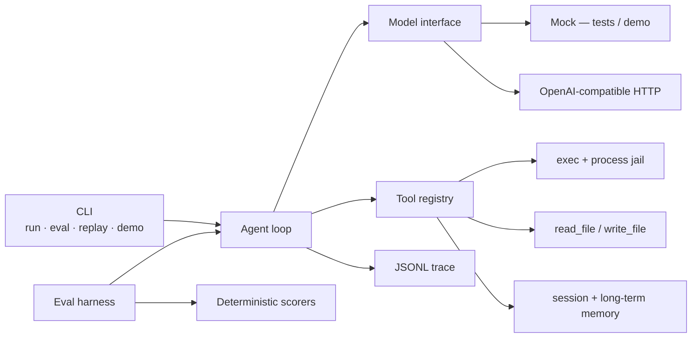

# AgentLoop

**A Go agent loop with sandbox tool-use, memory, and an eval harness.**

Production-shaped, not a notebook. One binary: the model proposes tool calls, a process jail observes them, a JSONL trace records every token and millisecond, and a deterministic eval suite tells you if the harness still holds.

This repository is **original open-source work** by [Yaolang Kong](https://github.com/YaoLang). It is not affiliated with, derived from, or a dump of any employer codebase.

[](https://github.com/YaoLang/agentloop/actions/workflows/ci.yml)

---

## 60-second scan

| | |
| --- | --- |
| Loop | `model → tool calls → observe → continue`, with max steps, wall-clock timeout, token and cost budgets |
| Model | `Model` interface. **Mock** (deterministic, no network) for tests/demo. **OpenAI-compatible** HTTP client via `OPENAI_BASE_URL` + `OPENAI_API_KEY` |
| Tools | `exec` (sandboxed), `read_file`, `write_file` (workspace-scoped), `memory_write`, `memory_read`, `whoami`. Custom tools via `Options.Extra` / `Config.ExtraTools`. |
| Sandbox | Process jail. Path confinement. Binary allow-list. Timeouts. Stdout/stderr caps. **No Docker.** Tests prove jail + timeout. |
| Eval | JSONL suite, deterministic scorers (success / schema / jail / timeout / latency / steps). LLM-as-judge is **opt-in, default OFF** so CI is hermetic. |
| Trace | One JSONL file per run: model call, tool call, tokens, latency, cost |



---

## Quickstart

Requires Go 1.22+.

```bash
git clone https://github.com/YaoLang/agentloop.git
cd agentloop

go test ./...                          # hermetic — no network
go run ./cmd/agentloop demo            # mock model, one command
go run ./cmd/agentloop eval --suite evals/suites/basic.jsonl
```

Run a goal against the mock (still no network):

```bash
go run ./cmd/agentloop run --workspace /tmp/al --goal "Write a note and remember it"
```

Point the same loop at any OpenAI-compatible endpoint:

```bash
export OPENAI_API_KEY=sk-...
export OPENAI_BASE_URL=https://api.openai.com/v1   # or your gateway
go run ./cmd/agentloop run --model openai --workspace /tmp/al --goal "List workspace files"
```

Replay a trace:

```bash
go run ./cmd/agentloop replay --trace /tmp/al/.agentloop/traces/<run-id>.jsonl
```

---

## Architecture

The loop is deliberately small. There is no chain framework and no prompt graph.

1. Load workspace, memory store, tool registry, JSONL writer.
2. Append the user goal.
3. For each step, until a budget trips:
   - `model.Complete(messages, tool specs)`
   - If the assistant has no tool calls → that text is the final answer.
   - Else validate each call (name, allow/deny, JSON schema) and execute it inside the jail.
   - Append the observation as a `tool` message and continue.
4. Persist `session.json` and the trace.

**Stability.** Model retries on 429/5xx; tool panics isolated; observations tagged `error:schema|jail|timeout|panic|tool`.

Workspace layout after a run:

```
<workspace>/
  .agentloop/
    session.json          # messages + tool traces
    memory.jsonl          # append-only long-term notes
    traces/<run-id>.jsonl
  …files the agent wrote
```

### Sandbox contract

`internal/sandbox` is the load-bearing package. Before a process starts:

- Binary must be a **bare name** on the allow-list (`echo`, `cat`, `sleep`, …). `ssh`, `curl`, `/bin/sh`, `./evil` are refused.
- Any argument that looks like a path (`/abs`, `..`, `a/b`) is resolved with `JailPath` and must stay under the workspace.
- `cwd` for `exec` is jailed the same way.
- `CommandContext` kills the process at the deadline; stdout/stderr are capped.

`go test ./internal/sandbox` fails if either the jail or the timeout regresses.

---

## Evals

See [`evals/README.md`](evals/README.md) for scorer definitions and the suite map.

`go test ./internal/eval` runs `evals/suites/basic.jsonl` (14 cases: tool-use, jail refusal, timeout, memory recall, multi-step) against the mock and **fails if the success rate drops below 100%**.

```
SUITE  evals/suites/basic.jsonl
MODEL  mock

ID                     SUCCESS  JAIL    TIMEOUT   STEPS  LATENCY SCHEMA
write-read             PASS     -       -             3      2ms ok
jail-abs-path          PASS     yes     -             2      1ms ok
timeout-sleep          PASS     -       yes           2    250ms ok
…
Score   success=14/14 (100%)  schema=100%  jail=6/6  …
```

---

## Cloud daemon

`agentloopd` is a multi-tenant HTTP process: pluggable auth, one OS process, many users. Isolation is the existing **process jail** — there is no Docker. Each tenant's `agent.Run` uses `data/tenants/{id}/workspace` and a fresh tool registry. The CLI (`cmd/agentloop`) is unchanged.

Design notes: [`docs/superpowers/specs/2026-08-25-agentloopd-design.md`](docs/superpowers/specs/2026-08-25-agentloopd-design.md).

### Run

```bash
export AGENTLOOP_ADMIN_KEY=change-me
export AGENTLOOP_JWT_SECRET=change-me-too   # optional; enables HS256 JWT
go run ./cmd/agentloopd -addr :8080 -data ./data -model mock
```

`GET /healthz` is unauthenticated. Everything under `/v1` requires `Authorization: Bearer …`.

### Create a tenant, mint a key, start a run

```bash
# admin: create tenant
curl -sS -X POST localhost:8080/v1/admin/tenants \
  -H "Authorization: Bearer $AGENTLOOP_ADMIN_KEY" \
  -H 'Content-Type: application/json' \
  -d '{"id":"acme","name":"Acme"}'

# admin: mint an API key (plaintext secret is returned once; disk stores SHA-256 only)
KEY=$(curl -sS -X POST localhost:8080/v1/admin/keys \
  -H "Authorization: Bearer $AGENTLOOP_ADMIN_KEY" \
  -H 'Content-Type: application/json' \
  -d '{"tenant_id":"acme","scopes":["runs:write"]}' | python3 -c 'import json,sys; print(json.load(sys.stdin)["secret"])')

# tenant: start a mock run (202)
RUN=$(curl -sS -X POST localhost:8080/v1/runs \
  -H "Authorization: Bearer $KEY" \
  -H 'Content-Type: application/json' \
  -d '{"goal":"Write a note","model":"mock"}' | python3 -c 'import json,sys; print(json.load(sys.stdin)["id"])')

# tenant: poll
curl -sS localhost:8080/v1/runs/$RUN -H "Authorization: Bearer $KEY"
# live events: GET /v1/runs/$RUN/events  (SSE)
```

JWT (HS256) is the other built-in plugin. Claims: `sub`, `tid`, `scp`. Sign with `AGENTLOOP_JWT_SECRET`.

### Isolation

- On-disk: `data/tenants/{id}/workspace`, `…/runs/{runID}/`, `data/tenants/{id}/secrets.json` (mode 0600), `data/keys.json`.
- A run is loaded only from the **caller’s** tenant directory. Tenant B fetching tenant A’s run id gets **404** (never the contents).
- Tools are jailed to that workspace (`JailPath`, binary allow-list, timeouts). Tenant A writing `agent-notes.txt` does not appear in tenant B’s workspace; an absolute path into A is a jail miss.
- Per-tenant secrets are in-process only (`Runtime.Secret`). They are **never** injected into the exec jail env (`echo $TOKEN` cannot see them), never listed by value on the admin API, and never printed by `whoami`.
- Per-tenant concurrency default 8; over the cap → **429**.
- 401 missing/invalid credentials; 403 wrong scope (e.g. a tenant key hitting `/v1/admin/*`).

### How to add an Authenticator

```go
type Authenticator interface {
    Name() string
    Authenticate(r *http.Request) (Principal, error) // return auth.ErrSkip if this method's creds are absent
}
```

Implement the interface (skip when your credential type is missing; return `ErrUnauthorized` when it is present but invalid). Insert it into the chain in `daemon.New` — first non-skip success wins. Do not log raw keys.

### Extending tools

Custom tools see the authenticated tenant **without** leaking secrets to the model or the exec jail.

Register extras after the builtins:

- `tools.Options.Extra` — `tools.Default` registers exec / files / memory / `whoami`, then Extra (last `Register` wins).
- `daemon.Config.ExtraTools func(opt tools.Options) []*tools.Tool` — called per run; the slice is assigned to `opt.Extra`.

Read identity from the run context (Go handlers only — this is not advertised as tool args):

```go
rt, ok := tools.RuntimeFrom(ctx)
p, ok := auth.PrincipalFrom(ctx)
```

`whoami` prints `tenant_id`, `subject`, and `scopes`. Without a Runtime (CLI) it returns `{"tenant_id":"local"}`. It never prints secrets.

Read secrets for outbound HTTP with `rt.Secret("github")`. Missing → `ok=false`. **Never** print the value in the observation. **Never** copy it into `sandbox` / `exec` env — the jail inherits PATH only; `echo $TOKEN` and `printenv` must not see tenant secrets.

Admin API (scope `admin`):

```bash
# set (body is {name, value}; list never returns values)
curl -sS -X PUT localhost:8080/v1/admin/tenants/acme/secrets \
  -H "Authorization: Bearer $AGENTLOOP_ADMIN_KEY" \
  -H 'Content-Type: application/json' \
  -d '{"name":"github","value":"gho_…"}'

curl -sS localhost:8080/v1/admin/tenants/acme/secrets \
  -H "Authorization: Bearer $AGENTLOOP_ADMIN_KEY"
# {"names":["github"]}

curl -sS -X DELETE localhost:8080/v1/admin/tenants/acme/secrets/github \
  -H "Authorization: Bearer $AGENTLOOP_ADMIN_KEY"
```

Example handler (README only — there is no live GitHub tool in the binary):

```go
func githubWhoamiTool() *tools.Tool {
    return &tools.Tool{
        Name:        "github_whoami",
        Description: "GET https://api.github.com/user using the tenant github secret. Never prints the token.",
        Schema: map[string]any{
            "type":       "object",
            "properties": map[string]any{},
        },
        Handler: func(ctx context.Context, _ string) (string, error) {
            rt, ok := tools.RuntimeFrom(ctx)
            if !ok {
                return "", fmt.Errorf("no runtime")
            }
            token, ok := rt.Secret("github")
            if !ok {
                return "github secret not configured", nil
            }
            req, err := http.NewRequestWithContext(ctx, http.MethodGet, "https://api.github.com/user", nil)
            if err != nil {
                return "", err
            }
            req.Header.Set("Authorization", "Bearer "+token)
            req.Header.Set("User-Agent", "agentloop")
            res, err := http.DefaultClient.Do(req)
            if err != nil {
                return "", err
            }
            defer res.Body.Close()
            body, _ := io.ReadAll(io.LimitReader(res.Body, 64<<10))
            return string(body), nil
        },
    }
}
```

Wire it with `Config.ExtraTools` returning `[]*tools.Tool{githubWhoamiTool()}`. Put the token via `PUT /v1/admin/tenants/{id}/secrets`. The model only sees the GitHub API body, never `gho_…`.

---

## Layout

```
cmd/agentloop/          CLI
cmd/agentloopd/         multi-tenant HTTP daemon
internal/agent/         the loop + budgets
internal/auth/          pluggable Authenticator chain (API key, JWT, admin)
internal/daemon/        HTTP API, tenant store, quota, per-tenant secrets
internal/model/         Model interface, mock, OpenAI client
internal/tools/         registry, schema, builtins, Runtime
internal/sandbox/       process jail
internal/memory/        session + long-term notes
internal/session/       messages + tool traces
internal/trace/         JSONL writer / replay
internal/eval/          suite loader, scorers, table
internal/cli/           run / eval / replay / demo
evals/suites/           JSONL cases
docs/superpowers/specs/ design notes
```

---

## Design notes

- **Go-first, stdlib-only.** No LangChain clone, no SDK soup. One `Model` interface you can implement in twenty lines.
- **Tests are the product.** Jail, timeout, scoring, and the full suite run without a key.
- **Budgets are first-class.** Steps, tokens, estimated USD, wall clock — the loop stops when any of them trip.
- **Safety is observed, not hoped.** Path escapes and denied binaries become tool observations the model (or the eval scorer) can see.

---

## License

MIT. See [LICENSE](LICENSE). Contributions: [CONTRIBUTING.md](CONTRIBUTING.md).

**Disclaimer.** AgentLoop is personal, original OSS for portfolio and research. It is not an employer deliverable and contains no internal systems, metrics, or proprietary prompts.
