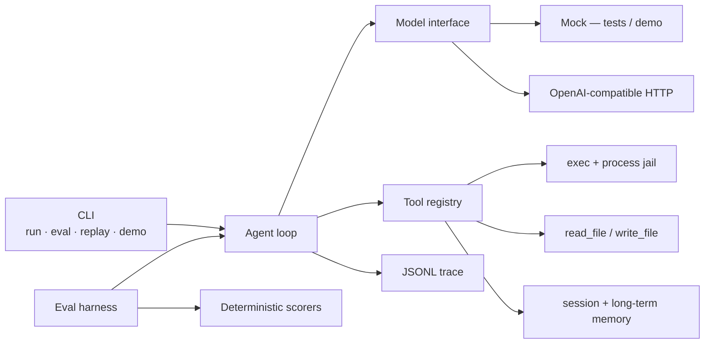

# AgentLoop

**A Go agent loop with sandbox tool-use, memory, and an eval harness.**

Production-shaped, not a notebook. One binary: the model proposes tool calls, a process jail observes them, a JSONL trace records every token and millisecond, and a deterministic eval suite tells you if the harness still holds.

This repository is **original open-source work** by [Yaolang Kong](https://github.com/YaoLang). It is not affiliated with, derived from, or a dump of any employer codebase.

[](https://github.com/YaoLang/agentloop/actions/workflows/ci.yml)

---

## 60-second scan

| | |
| --- | --- |
| Loop | `model → tool calls → observe → continue`, with max steps, wall-clock timeout, token and cost budgets |
| Model | `Model` interface. **Mock** (deterministic, no network) for tests/demo. **OpenAI-compatible** HTTP client via `OPENAI_BASE_URL` + `OPENAI_API_KEY` |
| Tools | `exec` (sandboxed), `read_file`, `write_file` (workspace-scoped), `memory_write`, `memory_read` (session + append-only long-term notes) |
| Sandbox | Process jail. Path confinement. Binary allow-list. Timeouts. Stdout/stderr caps. **No Docker.** Tests prove jail + timeout. |
| Eval | JSONL suite, deterministic scorers (success / schema / jail / timeout / latency / steps). LLM-as-judge is **opt-in, default OFF** so CI is hermetic. |
| Trace | One JSONL file per run: model call, tool call, tokens, latency, cost |



---

## Quickstart

Requires Go 1.22+.

```bash
git clone https://github.com/YaoLang/agentloop.git
cd agentloop

go test ./...                          # hermetic — no network
go run ./cmd/agentloop demo            # mock model, one command
go run ./cmd/agentloop eval --suite evals/suites/basic.jsonl
```

Run a goal against the mock (still no network):

```bash
go run ./cmd/agentloop run --workspace /tmp/al --goal "Write a note and remember it"
```

Point the same loop at any OpenAI-compatible endpoint:

```bash
export OPENAI_API_KEY=sk-...
export OPENAI_BASE_URL=https://api.openai.com/v1   # or your gateway
go run ./cmd/agentloop run --model openai --workspace /tmp/al --goal "List workspace files"
```

Replay a trace:

```bash
go run ./cmd/agentloop replay --trace /tmp/al/.agentloop/traces/<run-id>.jsonl
```

---

## Architecture

The loop is deliberately small. There is no chain framework, no prompt graph, no hidden retries.

1. Load workspace, memory store, tool registry, JSONL writer.
2. Append the user goal.
3. For each step, until a budget trips:
   - `model.Complete(messages, tool specs)`
   - If the assistant has no tool calls → that text is the final answer.
   - Else validate each call (name, allow/deny, JSON schema) and execute it inside the jail.
   - Append the observation as a `tool` message and continue.
4. Persist `session.json` and the trace.

Workspace layout after a run:

```
<workspace>/
  .agentloop/
    session.json          # messages + tool traces
    memory.jsonl          # append-only long-term notes
    traces/<run-id>.jsonl
  …files the agent wrote
```

### Sandbox contract

`internal/sandbox` is the load-bearing package. Before a process starts:

- Binary must be a **bare name** on the allow-list (`echo`, `cat`, `sleep`, …). `ssh`, `curl`, `/bin/sh`, `./evil` are refused.
- Any argument that looks like a path (`/abs`, `..`, `a/b`) is resolved with `JailPath` and must stay under the workspace.
- `cwd` for `exec` is jailed the same way.
- `CommandContext` kills the process at the deadline; stdout/stderr are capped.

`go test ./internal/sandbox` fails if either the jail or the timeout regresses.

---

## Evals

See [`evals/README.md`](evals/README.md) for scorer definitions and the suite map.

`go test ./internal/eval` runs `evals/suites/basic.jsonl` (14 cases: tool-use, jail refusal, timeout, memory recall, multi-step) against the mock and **fails if the success rate drops below 100%**.

```
SUITE  evals/suites/basic.jsonl
MODEL  mock

ID                     SUCCESS  JAIL    TIMEOUT   STEPS  LATENCY SCHEMA
write-read             PASS     -       -             3      2ms ok
jail-abs-path          PASS     yes     -             2      1ms ok
timeout-sleep          PASS     -       yes           2    250ms ok
…
Score   success=14/14 (100%)  schema=100%  jail=6/6  …
```

---

## Layout

```
cmd/agentloop/          CLI
internal/agent/         the loop + budgets
internal/model/         Model interface, mock, OpenAI client
internal/tools/         registry, schema, builtins
internal/sandbox/       process jail
internal/memory/        session + long-term notes
internal/session/       messages + tool traces
internal/trace/         JSONL writer / replay
internal/eval/          suite loader, scorers, table
internal/cli/           run / eval / replay / demo
evals/suites/           JSONL cases
```

---

## Design notes

- **Go-first, stdlib-only.** No LangChain clone, no SDK soup. One `Model` interface you can implement in twenty lines.
- **Tests are the product.** Jail, timeout, scoring, and the full suite run without a key.
- **Budgets are first-class.** Steps, tokens, estimated USD, wall clock — the loop stops when any of them trip.
- **Safety is observed, not hoped.** Path escapes and denied binaries become tool observations the model (or the eval scorer) can see.

---

## License

MIT. See [LICENSE](LICENSE). Contributions: [CONTRIBUTING.md](CONTRIBUTING.md).

**Disclaimer.** AgentLoop is personal, original OSS for portfolio and research. It is not an employer deliverable and contains no internal systems, metrics, or proprietary prompts.
