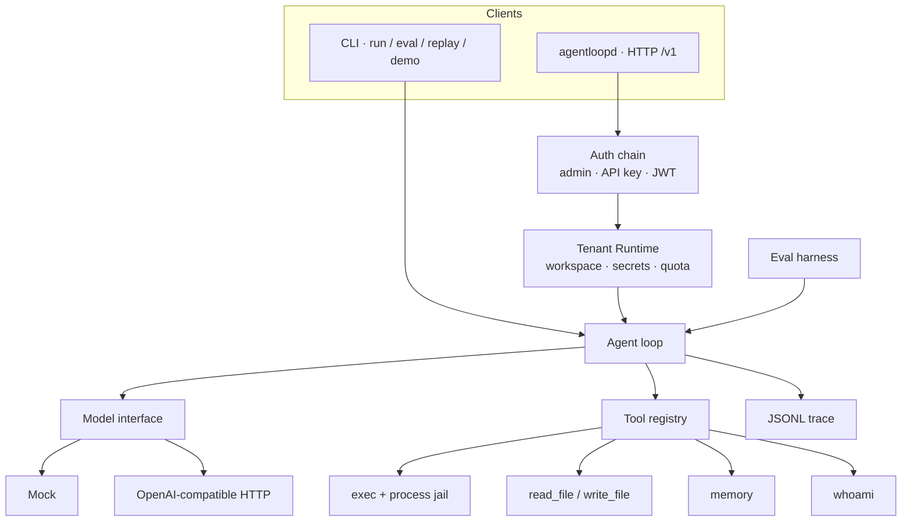

# AgentLoop

[English](README.md) · [中文](README.zh-CN.md)

**A Go agent loop with sandbox tool-use, memory, an eval harness, and a multi-tenant cloud daemon.**

The model proposes tool calls. A process jail observes them. A JSONL trace records every token and millisecond. A deterministic eval suite tells you if the harness still holds. `agentloopd` puts the same loop behind pluggable auth so many tenants can share one process without seeing each other’s files, runs, or secrets.

This repository is **original open-source work** by [Yaolang Kong](https://github.com/YaoLang). It is not affiliated with, derived from, or a dump of any employer codebase.

[](https://github.com/YaoLang/agentloop/actions/workflows/ci.yml)

---

## 60-second scan

| | |
| --- | --- |
| Loop | `model → tool calls → observe → continue`, with max steps, wall-clock timeout, token and cost budgets |
| Model | `Model` interface. **Mock** (deterministic, no network). **OpenAI-compatible** HTTP via `OPENAI_BASE_URL` + `OPENAI_API_KEY` |
| Tools | `exec`, `read_file`, `write_file`, `memory_write`, `memory_read`, `whoami`. Custom tools via `Options.Extra` / `Config.ExtraTools` |
| Sandbox | Process jail. Path confinement. Binary allow-list. Timeouts. Stdout/stderr caps. Exec env is **PATH only**. No Docker |
| Auth | Plugin chain: admin key → hashed API key (`alk_…`) → HS256 JWT. Add OIDC as another `Authenticator` |
| Isolation | Per-tenant workspace, runs, secrets, concurrency quota. Cross-tenant run fetch is **404** |
| Eval | JSONL suite, deterministic scorers. LLM-as-judge is **opt-in, default OFF** |
| Trace | One JSONL file per run: model call, retry, tool call, tokens, latency, cost |



---

## Requirements

- Go 1.22+
- No extra modules. Stdlib only. No CGO, no Docker, no Kubernetes.

---

## Quickstart (CLI)

```bash
git clone https://github.com/YaoLang/agentloop.git
cd agentloop

go test ./...                          # hermetic, no network
go run ./cmd/agentloop demo            # mock model, one command
go run ./cmd/agentloop eval --suite evals/suites/basic.jsonl
```

Mock run (still no network):

```bash
go run ./cmd/agentloop run --workspace /tmp/al --goal "Write a note and remember it"
```

Same loop against any OpenAI-compatible endpoint:

```bash
export OPENAI_API_KEY=sk-...
export OPENAI_BASE_URL=https://api.openai.com/v1   # or your gateway
export OPENAI_MODEL=gpt-4o-mini                    # optional
go run ./cmd/agentloop run --model openai --workspace /tmp/al --goal "List workspace files"
```

Replay a trace:

```bash
go run ./cmd/agentloop replay --trace /tmp/al/.agentloop/traces/<run-id>.jsonl
```

---

## Architecture

The loop is small on purpose. There is no chain framework and no prompt graph.

1. Load workspace, memory store, tool registry, JSONL writer.
2. Append the user goal.
3. For each step, until a budget trips:
   - `model.Complete(messages, tool specs)` (retries on 429/5xx; see [Stability](#stability))
   - If the assistant has no tool calls, that text is the final answer.
   - Else validate each call (name, allow/deny, JSON schema) and execute it inside the jail.
   - Append the observation as a `tool` message and continue. Tool failures do **not** abort the run.
4. Persist `session.json` and the trace.

Workspace after a run:

```
<workspace>/
  .agentloop/
    session.json          # messages + tool traces
    memory.jsonl          # append-only long-term notes
    traces/<run-id>.jsonl
  …files the agent wrote
```

### Built-in tools

| Tool | What it does |
| --- | --- |
| `exec` | Allow-listed binary in the workspace jail. Path args and `cwd` are jailed. |
| `read_file` / `write_file` | UTF-8 files under the workspace. `..` and absolute escapes are refused. |
| `memory_write` / `memory_read` | `scope=session` (in-process) or `longterm` (append-only JSONL). |
| `whoami` | `{tenant_id, subject, scopes}`. CLI without a Runtime returns `{"tenant_id":"local"}`. Never prints secrets. |

### Sandbox contract

`internal/sandbox` is the load-bearing package. Before a process starts:

- Binary must be a **bare name** on the allow-list (`echo`, `cat`, `sleep`, …). `ssh`, `curl`, `/bin/sh`, `./evil` are refused.
- Any argument that looks like a path (`/abs`, `..`, `a/b`) is resolved with `JailPath` and must stay under the workspace.
- `cwd` for `exec` is jailed the same way.
- `CommandContext` kills the process at the deadline; stdout/stderr are capped.
- Child env is **`PATH` only**. Daemon keys (`AGENTLOOP_ADMIN_KEY`, `OPENAI_API_KEY`, tenant secrets) are not inherited. `echo $TOKEN` cannot see them.

`go test ./internal/sandbox` fails if the jail or the timeout regresses.

---

## Stability

| Failure | What happens |
| --- | --- |
| OpenAI HTTP 429 / 502 / 503 / 504, empty choices, truncated JSON, transport errors | Retry up to 3 times. Honors `Retry-After`. Exponential backoff, cap 2s. |
| HTTP 400 / 401 / 403 / 404, or parent `context` cancel / deadline | No retry. |
| Empty assistant message and no tool calls | One extra retry, then `StopReason=model_empty`. |
| Tool schema / jail / timeout / panic / other | Observation tagged `error:schema` / `jail` / `timeout` / `panic` / `tool`. The loop **continues**. |
| Handler `panic` | Recovered in `Registry.Call`. The process stays up. `Result.Panics` is counted. |

Trace events include `model_retry` when a model call is retried.

---

## Evals

See [`evals/README.md`](evals/README.md) for scorer definitions and the suite map.

`go test ./internal/eval` runs `evals/suites/basic.jsonl` (14 cases: tool-use, jail refusal, timeout, memory recall, multi-step) against the mock and **fails if success drops below 100%**.

The `script` in each case is what the **mock model** emits. The sandbox, tools, memory, and loop are real. We grade the harness, not the LLM.

---

## Cloud daemon (`agentloopd`)

One OS process, many tenants. Isolation is the existing process jail — not Docker, not a pod per user. Each tenant’s `agent.Run` uses `data/tenants/{id}/workspace` and a fresh tool registry. The CLI is unchanged.

Design notes: [`docs/superpowers/specs/2026-08-25-agentloopd-design.md`](docs/superpowers/specs/2026-08-25-agentloopd-design.md).

### Run

```bash
export AGENTLOOP_ADMIN_KEY=change-me
export AGENTLOOP_JWT_SECRET=change-me-too   # optional; enables HS256 JWT
go run ./cmd/agentloopd -addr :8080 -data ./data -model mock
```

| Flag / env | Role |
| --- | --- |
| `-addr` | Listen address (default `:8080`) |
| `-data` | Data root (default `./data`). Never commit this directory |
| `-model` | Default model for runs: `mock` or `openai` |
| `AGENTLOOP_ADMIN_KEY` | Bearer → principal `tenant=_admin`, scopes `admin`, `runs:write`, `runs:read` |
| `AGENTLOOP_JWT_SECRET` | HS256 secret for the JWT plugin |
| `OPENAI_API_KEY` / `OPENAI_BASE_URL` | Only when a run requests model `openai` |

`GET /healthz` is unauthenticated. Everything under `/v1` requires `Authorization: Bearer …`.

### HTTP API

| Method | Path | Scope | Notes |
| --- | --- | --- | --- |
| `GET` | `/healthz` | — | Liveness |
| `POST` | `/v1/admin/tenants` | `admin` | `{id, name}` |
| `GET` | `/v1/admin/tenants` | `admin` | List tenants |
| `POST` | `/v1/admin/keys` | `admin` | `{tenant_id, scopes}` — plaintext secret returned **once**; disk stores SHA-256 |
| `PUT` | `/v1/admin/tenants/{id}/secrets` | `admin` | `{name, value}` |
| `GET` | `/v1/admin/tenants/{id}/secrets` | `admin` | `{names:[…]}` only, never values |
| `DELETE` | `/v1/admin/tenants/{id}/secrets/{name}` | `admin` | |
| `POST` | `/v1/runs` | `runs:write` | `{goal, model}` → **202** `{id, status}` |
| `GET` | `/v1/runs/{id}` | caller’s tenant | Status, final, steps. Other tenant’s id → **404** |
| `GET` | `/v1/runs/{id}/events` | caller’s tenant | SSE |

Over per-tenant concurrency (default 8) → **429**. Missing/invalid credentials → **401**. Wrong scope → **403**.

### Create a tenant, mint a key, start a run

```bash
curl -sS -X POST localhost:8080/v1/admin/tenants \
  -H "Authorization: Bearer $AGENTLOOP_ADMIN_KEY" \
  -H 'Content-Type: application/json' \
  -d '{"id":"acme","name":"Acme"}'

KEY=$(curl -sS -X POST localhost:8080/v1/admin/keys \
  -H "Authorization: Bearer $AGENTLOOP_ADMIN_KEY" \
  -H 'Content-Type: application/json' \
  -d '{"tenant_id":"acme","scopes":["runs:write"]}' \
  | python3 -c 'import json,sys; print(json.load(sys.stdin)["secret"])')

RUN=$(curl -sS -X POST localhost:8080/v1/runs \
  -H "Authorization: Bearer $KEY" \
  -H 'Content-Type: application/json' \
  -d '{"goal":"Write a note","model":"mock"}' \
  | python3 -c 'import json,sys; print(json.load(sys.stdin)["id"])')

curl -sS localhost:8080/v1/runs/$RUN -H "Authorization: Bearer $KEY"
# live events: GET /v1/runs/$RUN/events
```

JWT (HS256) is the other built-in plugin. Claims: `sub`, `tid`, `scp` (array or space-separated). Sign with `AGENTLOOP_JWT_SECRET`. `alg=none` is rejected.

### Isolation

On disk:

```
data/
  keys.json                                 # SHA-256 hashes only
  tenants/{id}/meta.json
  tenants/{id}/workspace/                   # agent.Run Workspace
  tenants/{id}/secrets.json                 # mode 0600; values never listed on GET
  tenants/{id}/runs/{runID}/status.json
  tenants/{id}/runs/{runID}/events.jsonl
```

Tenant IDs and run IDs are a single path component `[A-Za-z0-9_-]{1,64}`. `_admin` is reserved.

- A run is loaded only from the **caller’s** tenant directory. Tenant B fetching tenant A’s run id gets **404**, never the contents.
- Tools are jailed to that workspace. An absolute path into A is a jail miss.
- Per-tenant secrets are in-process only (`Runtime.Secret`). They are not injected into exec env, not listed by value, not printed by `whoami`.
- Tenant A’s `github` secret is **absent** on tenant B’s Runtime.

### How to add an Authenticator

```go
type Authenticator interface {
    Name() string
    Authenticate(r *http.Request) (Principal, error) // auth.ErrSkip if this method's creds are absent
}
```

Skip when your credential type is missing. Return `ErrUnauthorized` when it is present but invalid. Insert into the chain in `daemon.New` — first non-skip success wins. Do not log raw keys.

Default chain: **admin → API key (`alk_…`) → JWT HS256**.

---

## Extending tools (keep the auth environment)

Custom tools see the authenticated tenant **without** leaking secrets to the model or the exec jail.

Register extras after the builtins:

- `tools.Options.Extra` — `tools.Default` registers exec / files / memory / `whoami`, then Extra (last `Register` wins).
- `daemon.Config.ExtraTools func(opt tools.Options) []*tools.Tool` — called **per run**; the slice is assigned to `opt.Extra`.

Read identity from the run context (Go handlers only — this is not a tool argument):

```go
rt, ok := tools.RuntimeFrom(ctx)
p, ok := auth.PrincipalFrom(ctx)
token, ok := rt.Secret("github") // missing → ok=false; never print token
```

`agentloopd` attaches `auth.WithPrincipal` and `tools.WithRuntime` on the same `ctx` that `agent.Run` already passes to `Registry.Call`. The CLI has no tenant; `whoami` then reports `tenant_id=local`.

Admin secrets API:

```bash
curl -sS -X PUT localhost:8080/v1/admin/tenants/acme/secrets \
  -H "Authorization: Bearer $AGENTLOOP_ADMIN_KEY" \
  -H 'Content-Type: application/json' \
  -d '{"name":"github","value":"gho_…"}'
```

Example handler (README only — there is no live GitHub tool in the binary):

```go
func githubWhoamiTool() *tools.Tool {
    return &tools.Tool{
        Name:        "github_whoami",
        Description: "GET https://api.github.com/user using the tenant github secret. Never prints the token.",
        Schema: map[string]any{
            "type":       "object",
            "properties": map[string]any{},
        },
        Handler: func(ctx context.Context, _ string) (string, error) {
            rt, ok := tools.RuntimeFrom(ctx)
            if !ok {
                return "", fmt.Errorf("no runtime")
            }
            token, ok := rt.Secret("github")
            if !ok {
                return "github secret not configured", nil
            }
            req, err := http.NewRequestWithContext(ctx, http.MethodGet, "https://api.github.com/user", nil)
            if err != nil {
                return "", err
            }
            req.Header.Set("Authorization", "Bearer "+token)
            req.Header.Set("User-Agent", "agentloop")
            res, err := http.DefaultClient.Do(req)
            if err != nil {
                return "", err
            }
            defer res.Body.Close()
            body, _ := io.ReadAll(io.LimitReader(res.Body, 64<<10))
            return string(body), nil
        },
    }
}
```

Wire it with `Config.ExtraTools` returning `[]*tools.Tool{githubWhoamiTool()}`. Put the token via `PUT /v1/admin/tenants/{id}/secrets`. The model only sees the GitHub API body, never `gho_…`.

---

## Layout

```
cmd/agentloop/          CLI
cmd/agentloopd/         multi-tenant HTTP daemon
internal/agent/         the loop, budgets, model retries
internal/auth/          pluggable Authenticator chain
internal/daemon/        HTTP API, tenant store, quota, secrets
internal/model/         Model interface, mock, OpenAI client
internal/tools/         registry, schema, builtins, Runtime
internal/sandbox/       process jail (PATH-only child env)
internal/memory/        session + long-term notes
internal/session/       messages + tool traces
internal/trace/         JSONL writer / replay
internal/eval/          suite loader, scorers, table
internal/cli/           run / eval / replay / demo
evals/suites/           JSONL cases
docs/superpowers/specs/ design notes
```

---

## Design notes

- **Go-first, stdlib-only.** No LangChain clone, no SDK soup. One `Model` interface you can implement in twenty lines.
- **Tests are the product.** Jail, timeout, scoring, auth, isolation, and the full suite run without a key.
- **Budgets are first-class.** Steps, tokens, estimated USD, wall clock — the loop stops when any of them trip.
- **Safety is observed, not hoped.** Path escapes, denied binaries, and panics become tool observations the model (or the eval scorer) can see.
- **Auth stays in-process.** Secrets are for Go handlers making outbound HTTP, not for the jail and not for the model.

---

## License

MIT. See [LICENSE](LICENSE). Contributions: [CONTRIBUTING.md](CONTRIBUTING.md).

**Disclaimer.** AgentLoop is personal, original OSS for portfolio and research. It is not an employer deliverable and contains no internal systems, metrics, or proprietary prompts.
