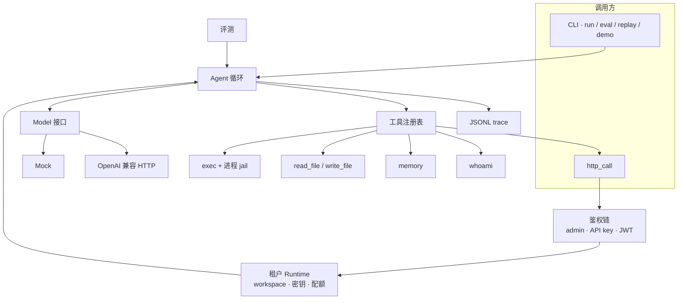

# AgentLoop

[English](README.md) · [中文](README.zh-CN.md)

**Go 实现的 Agent 循环：沙盒工具、记忆、评测，以及多租户云端守护进程。**

模型提出 tool call，进程 jail 负责执行，JSONL trace 记下每一步的 token 和耗时，确定性评测集告诉你 harness 有没有回退。`agentloopd` 把同一套 loop 放到可插拔鉴权后面，多个租户共用一个进程，彼此看不到对方的文件、run 和密钥。

本仓库是 [Yaolang Kong](https://github.com/YaoLang) 的**原创开源**，与任何雇主无关，也不是内部代码或指标的导出。

[](https://github.com/YaoLang/agentloop/actions/workflows/ci.yml)

---

## 一分钟看懂

| | |
| --- | --- |
| 循环 | `模型 → 工具调用 → 观察 → 继续`，有步数、墙钟、token、费用预算 |
| 模型 | `Model` 接口。**Mock**（确定性、无网络）。**OpenAI 兼容** HTTP（`OPENAI_BASE_URL` + `OPENAI_API_KEY`） |
| 工具 | `exec`、`read_file`、`write_file`、`memory_write`、`memory_read`、`whoami`、`http_call`（目录驱动）。自定义 Go：`Options.Extra` / `Config.ExtraTools` |
| 沙盒 | 进程 jail。路径封禁。二进制白名单。超时。输出封顶。子进程环境**只有 PATH**。不用 Docker |
| 鉴权 | 插件链：admin key → 哈希 API key（`alk_…`）→ HS256 JWT。OIDC 再实现一个 `Authenticator` 即可 |
| 隔离 | 每租户独立 workspace、run、密钥、并发配额。跨租户取 run 返回 **404** |
| 评测 | JSONL 套件 + 确定性打分。LLM-as-judge **默认关闭** |
| Trace | 每次 run 一份 JSONL：模型调用、重试、工具、token、耗时、费用 |



---

## 环境

- Go 1.22+
- 无第三方模块。只用标准库。无 CGO、无 Docker、无 Kubernetes。

---

## 快速开始（CLI）

```bash
git clone https://github.com/YaoLang/agentloop.git
cd agentloop

go test ./...                          # 封闭，不访问网络
go run ./cmd/agentloop demo            # mock 模型，一条命令
go run ./cmd/agentloop eval --suite evals/suites/basic.jsonl
```

Mock 跑一个目标（仍然无网络）：

```bash
go run ./cmd/agentloop run --workspace /tmp/al --goal "Write a note and remember it"
```

同一套 loop 接到任意 OpenAI 兼容网关：

```bash
export OPENAI_API_KEY=sk-...
export OPENAI_BASE_URL=https://api.openai.com/v1   # 或你的网关
export OPENAI_MODEL=gpt-4o-mini                    # 可选
go run ./cmd/agentloop run --model openai --workspace /tmp/al --goal "List workspace files"
```

回放 trace：

```bash
go run ./cmd/agentloop replay --trace /tmp/al/.agentloop/traces/<run-id>.jsonl
```

---

## 架构

Loop 故意写得很小。没有 chain 框架，没有 prompt 图。

1. 加载 workspace、记忆、工具注册表、JSONL writer。
2. 写入用户目标。
3. 每一步直到预算打满：
   - `model.Complete(messages, tool specs)`（429/5xx 会重试，见 [稳定性](#稳定性)）
   - 助手没有 tool call，那段文本就是最终答案。
   - 否则校验（名字、允许/拒绝、JSON Schema），在 jail 里执行。
   - 把观察写成 `tool` 消息再继续。工具失败**不会**整轮停掉。
4. 落盘 `session.json` 和 trace。

一次 run 之后的目录：

```
<workspace>/
  .agentloop/
    session.json          # 消息 + 工具轨迹
    memory.jsonl          # 只追加的长期记忆
    traces/<run-id>.jsonl
  …agent 写下的文件
```

### 内置工具

| 工具 | 作用 |
| --- | --- |
| `exec` | 白名单二进制，在 workspace jail 里跑。路径参数和 `cwd` 都要过 jail。 |
| `read_file` / `write_file` | workspace 内 UTF-8 文件。`..` 和绝对路径逃逸会被拒绝。 |
| `memory_write` / `memory_read` | `scope=session`（进程内）或 `longterm`（只追加 JSONL）。 |
| `whoami` | `{tenant_id, subject, scopes}`。CLI 没有 Runtime 时返回 `{"tenant_id":"local"}`。从不打印密钥。 |
| `http_call` | 一个工具对应多个接口。模型只选目录里的 `endpoint` id，不能传 URL、method 或 Authorization。 |

### 沙盒约定

`internal/sandbox` 是承重包。进程启动前：

- 二进制必须是白名单上的**裸名字**（`echo`、`cat`、`sleep` …）。`ssh`、`curl`、`/bin/sh`、`./evil` 一律拒绝。
- 看起来像路径的参数（`/abs`、`..`、`a/b`）走 `JailPath`，必须落在 workspace 内。
- `exec` 的 `cwd` 同样 jail。
- 到期用 `CommandContext` 杀掉进程；stdout/stderr 有上限。
- 子进程环境**只有 `PATH`**。守护进程的 `AGENTLOOP_ADMIN_KEY`、`OPENAI_API_KEY`、租户密钥都不会继承。`echo $TOKEN` 看不到。

`go test ./internal/sandbox` 在 jail 或超时回退时会失败。

---

## 稳定性

| 失败 | 行为 |
| --- | --- |
| OpenAI HTTP 429 / 502 / 503 / 504、空 choices、截断 JSON、传输错误 | 最多重试 3 次。认 `Retry-After`。指数退避，上限 2s。 |
| HTTP 400 / 401 / 403 / 404，或父 context 取消 / 超时 | 不重试。 |
| 空助手消息且没有 tool call | 再试一次，然后 `StopReason=model_empty`。 |
| 工具 schema / jail / 超时 / panic / 其他 | 观察带前缀 `error:schema` / `jail` / `timeout` / `panic` / `tool`。循环**继续**。 |
| Handler `panic` | `Registry.Call` 里 recover。进程不挂。计入 `Result.Panics`。 |

模型重试会写 `model_retry` trace 事件。

---

## 评测

打分定义和套件对照见 [`evals/README.md`](evals/README.md)。

`go test ./internal/eval` 用 mock 跑 `evals/suites/basic.jsonl`（14 条：工具、jail 拒绝、超时、记忆、多步），**成功率低于 100% 即失败**。

每条 case 里的 `script` 是 **mock 模型**要吐的内容。沙盒、工具、记忆、loop 都是真的。我们评的是 harness，不是 LLM。

---

## 云端守护进程（`agentloopd`）

一个 OS 进程，多个租户。隔离靠现有进程 jail，不是 Docker，也不是一用户一 Pod。每个租户的 `agent.Run` 指向 `data/tenants/{id}/workspace`，并拿到一份新的工具注册表。CLI 不变。

设计说明：[`docs/superpowers/specs/2026-08-25-agentloopd-design.md`](docs/superpowers/specs/2026-08-25-agentloopd-design.md)。

### 启动

```bash
export AGENTLOOP_ADMIN_KEY=change-me
export AGENTLOOP_JWT_SECRET=change-me-too   # 可选；打开 HS256 JWT
go run ./cmd/agentloopd -addr :8080 -data ./data -model mock
```

| 参数 / 环境变量 | 作用 |
| --- | --- |
| `-addr` | 监听地址（默认 `:8080`） |
| `-data` | 数据根目录（默认 `./data`）。不要提交这个目录 |
| `-model` | run 的默认模型：`mock` 或 `openai` |
| `AGENTLOOP_ADMIN_KEY` | Bearer → 主体 `tenant=_admin`，scope `admin`、`runs:write`、`runs:read` |
| `AGENTLOOP_JWT_SECRET` | JWT 插件的 HS256 密钥 |
| `OPENAI_API_KEY` / `OPENAI_BASE_URL` | 仅当 run 指定 `openai` 时使用 |

`GET /healthz` 不鉴权。`/v1` 下都要 `Authorization: Bearer …`。

### HTTP API

| 方法 | 路径 | Scope | 说明 |
| --- | --- | --- | --- |
| `GET` | `/healthz` | — | 探活 |
| `POST` | `/v1/admin/tenants` | `admin` | `{id, name}` |
| `GET` | `/v1/admin/tenants` | `admin` | 租户列表 |
| `POST` | `/v1/admin/keys` | `admin` | `{tenant_id, scopes}` — 明文密钥**只返回一次**；磁盘只存 SHA-256 |
| `PUT` | `/v1/admin/tenants/{id}/secrets` | `admin` | `{name, value}` |
| `GET` | `/v1/admin/tenants/{id}/secrets` | `admin` | 只返回 `{names:[…]}`，没有 value |
| `DELETE` | `/v1/admin/tenants/{id}/secrets/{name}` | `admin` | |
| `POST` | `/v1/runs` | `runs:write` | `{goal, model}` → **202** `{id, status}` |
| `GET` | `/v1/runs/{id}` | 调用方租户 | 状态、final、步数。别人的 id → **404** |
| `GET` | `/v1/runs/{id}/events` | 调用方租户 | SSE |

超过每租户并发（默认 8）→ **429**。凭证缺失/无效 → **401**。scope 不对 → **403**。

### 建租户、发 key、开 run

```bash
curl -sS -X POST localhost:8080/v1/admin/tenants \
  -H "Authorization: Bearer $AGENTLOOP_ADMIN_KEY" \
  -H 'Content-Type: application/json' \
  -d '{"id":"acme","name":"Acme"}'

KEY=$(curl -sS -X POST localhost:8080/v1/admin/keys \
  -H "Authorization: Bearer $AGENTLOOP_ADMIN_KEY" \
  -H 'Content-Type: application/json' \
  -d '{"tenant_id":"acme","scopes":["runs:write"]}' \
  | python3 -c 'import json,sys; print(json.load(sys.stdin)["secret"])')

RUN=$(curl -sS -X POST localhost:8080/v1/runs \
  -H "Authorization: Bearer $KEY" \
  -H 'Content-Type: application/json' \
  -d '{"goal":"Write a note","model":"mock"}' \
  | python3 -c 'import json,sys; print(json.load(sys.stdin)["id"])')

curl -sS localhost:8080/v1/runs/$RUN -H "Authorization: Bearer $KEY"
# 实时事件：GET /v1/runs/$RUN/events
```

JWT（HS256）是另一套内置插件。Claims：`sub`、`tid`、`scp`（数组或空格分隔）。用 `AGENTLOOP_JWT_SECRET` 签名。`alg=none` 会被拒绝。

### 隔离

磁盘布局：

```
data/
  keys.json                                 # 只有 SHA-256
  tenants/{id}/meta.json
  tenants/{id}/http.json                    # 可选的出站 API 目录（不在 workspace/ 内）
  tenants/{id}/workspace/                   # agent.Run 的 Workspace
  tenants/{id}/secrets.json                 # 权限 0600；GET 不返回 value
  tenants/{id}/runs/{runID}/status.json
  tenants/{id}/runs/{runID}/events.jsonl
```

租户 ID、run ID 必须是单路径分量 `[A-Za-z0-9_-]{1,64}`。`_admin` 保留。

- run 只从**调用方**租户目录加载。租户 B 拿 A 的 run id 得到 **404**，不会泄露内容。
- 工具被 jail 在该 workspace。指向 A 的绝对路径是 jail 命中。
- 租户密钥只在进程内（`Runtime.Secret`）。不进 exec 环境，列表不带 value，`whoami` 不打印。
- 租户 A 的 `github` secret，在 B 的 Runtime 里是 **absent**。

### 如何加一种鉴权

```go
type Authenticator interface {
    Name() string
    Authenticate(r *http.Request) (Principal, error) // 本方法凭证不在请求上时返回 auth.ErrSkip
}
```

凭证类型不存在就 Skip；存在但无效返回 `ErrUnauthorized`。插入 `daemon.New` 的 chain，第一个非 skip 成功生效。不要打明文 key 日志。

默认链：**admin → API key（`alk_…`）→ JWT HS256**。

---

## 扩展工具（保留鉴权环境）

自定义工具能看到已鉴权的租户，**但不会**把密钥泄漏给模型或 exec jail。

- `tools.Options.Extra` — `tools.Default` 先注册内置工具（有目录时包括 `http_call`），再 Extra（后 `Register` 覆盖同名）。
- `daemon.Config.ExtraTools func(opt tools.Options) []*tools.Tool` — **每次 run** 调用一次，结果赋给 `opt.Extra`。ExtraTools 仍可用于自定义 Go handler。

接入站点自己的 HTTP API，**推荐**用租户目录 + `http_call`（见下一节）。ExtraTools 留给不是 HTTP API 的能力。

从 run 的 context 读身份（只给 Go handler 用，不是工具参数）：

```go
rt, ok := tools.RuntimeFrom(ctx)
p, ok := auth.PrincipalFrom(ctx)
token, ok := rt.Secret("shop_token") // 没有则 ok=false；永远不要打印 token
```

`agentloopd` 会在 `agent.Run` 已经传给 `Registry.Call` 的同一个 `ctx` 上挂上 `auth.WithPrincipal` 和 `tools.WithRuntime`。CLI 没有租户，此时 `whoami` 报 `tenant_id=local`。

Admin 写密钥：

```bash
curl -sS -X PUT localhost:8080/v1/admin/tenants/acme/secrets \
  -H "Authorization: Bearer $AGENTLOOP_ADMIN_KEY" \
  -H 'Content-Type: application/json' \
  -d '{"name":"shop_token","value":"…"}'
```

---

## HTTP 目录（`http_call`）

把 `agentloopd` 嵌进自己的站点，用**一个**工具接你的 HTTP API，而不是每个接口一个工具。模型从租户目录里选 `endpoint` id，不能传 URL、method 或 `Authorization`。

目录放在 `meta.json` **旁边**，**不要**放进 `workspace/`（这样 `write_file` 改不了白名单）：

`data/tenants/{id}/http.json`

示例见 [`examples/http.json`](examples/http.json)。

| 字段 | 作用 |
| --- | --- |
| `base_url` | 只允许 http / https。禁止 userinfo。 |
| `allow_hosts` | 主机名精确匹配（大小写不敏感，不含端口）。为空则用 `base_url` 的 host。 |
| `auth.secret` | 租户密钥的**名字**（`PUT /v1/admin/tenants/{id}/secrets`）。写入 `auth.header`（默认 `Authorization`）= `auth.prefix` + 值。 |
| `endpoints` | `{id, method, path, description}`。`path` 可用 `{name}` 占位符，由工具参数 `path` 填充。方法：GET、POST、PUT、PATCH、DELETE。 |

工具参数：`{endpoint, path, query, body}`。模型多传的 `url` / `method` / `headers` 会被忽略。

SSRF：只允许 http/https；拒绝 userinfo；主机名必须在 `allow_hosts` 中；解析到的 IP 若是回环 / 私网 / 链路本地 / 组播 / 未指定 / `169.254.169.254` 则拒绝，除非 `allow_hosts` 里就是这个**字面 IP**（所以 `httptest` 的 `127.0.0.1` 可以工作）。CheckRedirect：只跟同 host，最多 5 次；跨 host 重定向报错。

观察格式是 `HTTP {status}\n{body}`。从不回显请求头。JSON 里匹配 `(?i)token|secret|password|authorization|api[_-]?key` 的键会被替换成 `[redacted]`。若密钥原文仍出现会被去掉。HTTP 4xx/5xx 仍算工具成功，循环可以继续。目录缺失或无效时不注册 `http_call`，run 照常进行。

---

## 目录

```
cmd/agentloop/          CLI
cmd/agentloopd/         多租户 HTTP 守护进程
internal/agent/         循环、预算、模型重试
internal/auth/          可插拔 Authenticator 链
internal/daemon/        HTTP API、租户存储、配额、密钥
internal/model/         Model 接口、mock、OpenAI 客户端
internal/tools/         注册表、schema、内置工具、Runtime
internal/sandbox/       进程 jail（子进程只有 PATH）
internal/memory/        session + 长期记忆
internal/session/       消息 + 工具轨迹
internal/trace/         JSONL 写入 / 回放
internal/eval/          套件加载、打分、表格
internal/cli/           run / eval / replay / demo
evals/suites/           JSONL case
examples/http.json      租户 HTTP 目录示例
docs/superpowers/specs/ 设计说明
```

---

## 设计取舍

- **Go 优先，只用标准库。** 不是 LangChain 克隆，没有 SDK 汤。`Model` 接口二十行就能接一个实现。
- **测试就是产品。** jail、超时、打分、鉴权、隔离、整套评测都不需要 API key。
- **预算是一等公民。** 步数、token、估算美元、墙钟，任一打满 loop 就停。
- **安全要被观察到，而不是指望。** 路径逃逸、拒绝的二进制、panic，都会变成模型（或评测）能看到的观察。
- **鉴权留在进程内。** 密钥给 Go handler 做出站 HTTP，不给 jail，也不给模型。

---

## 许可证

MIT。见 [LICENSE](LICENSE)。贡献说明：[CONTRIBUTING.md](CONTRIBUTING.md)。

**声明。** AgentLoop 是个人原创开源，用于作品集和研究。它不是雇主交付物，不含内部系统、指标或专有 prompt。
